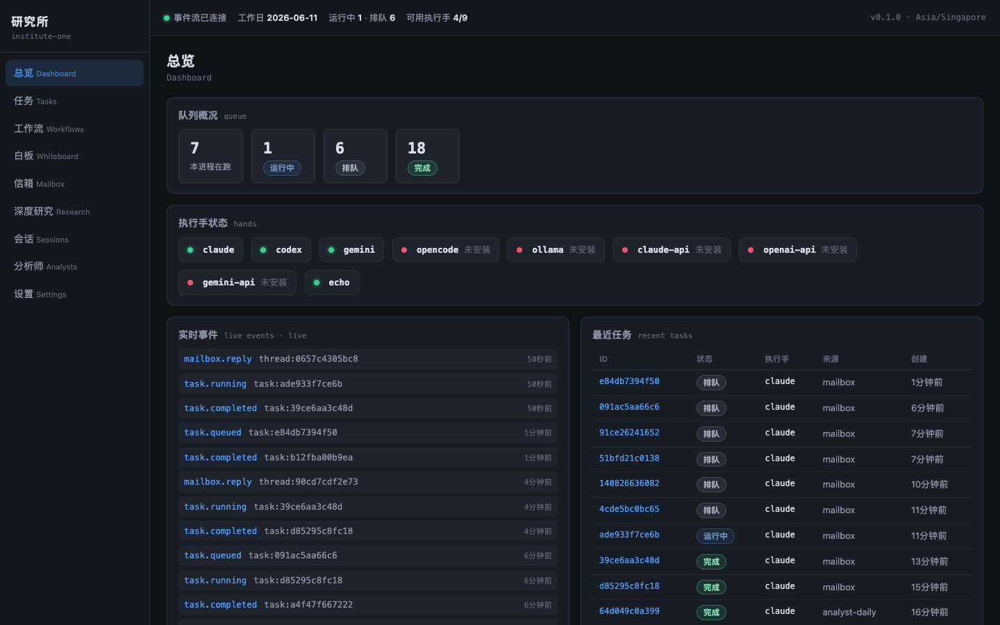
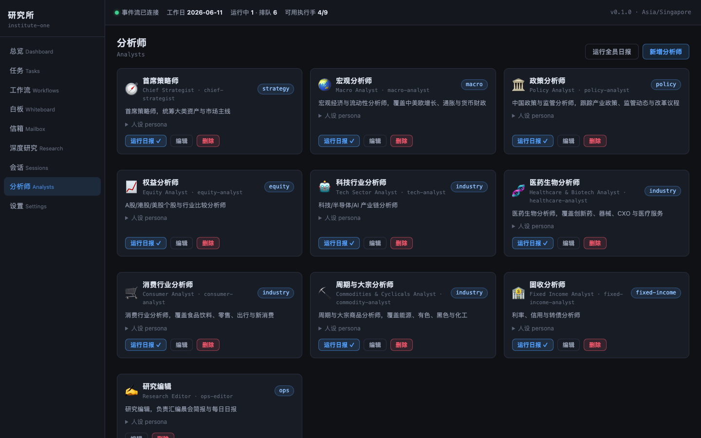
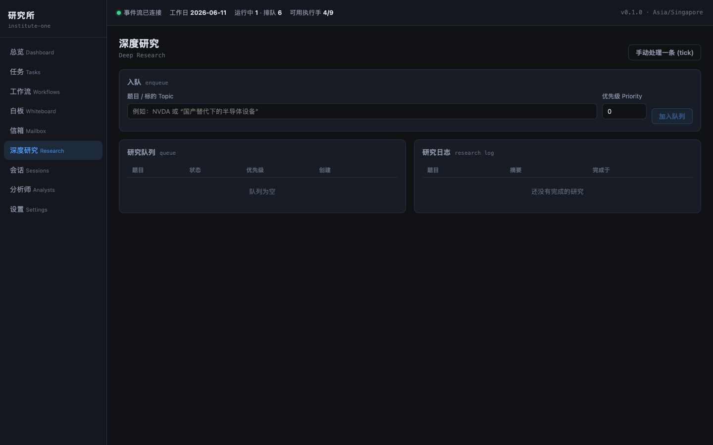
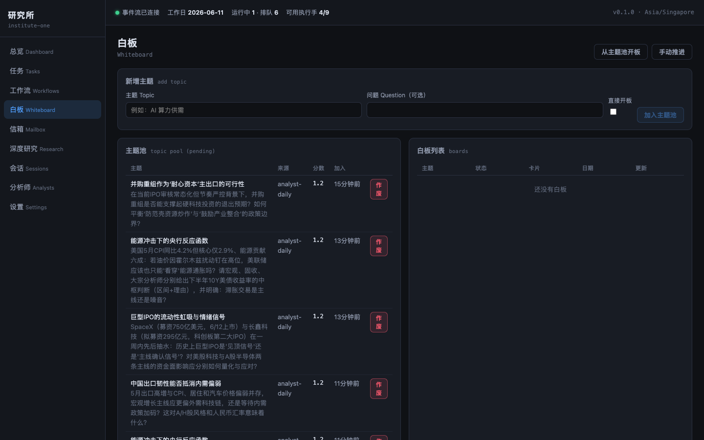
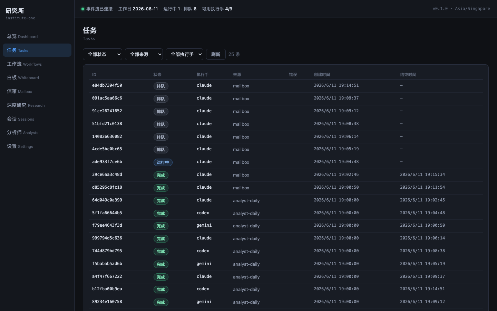
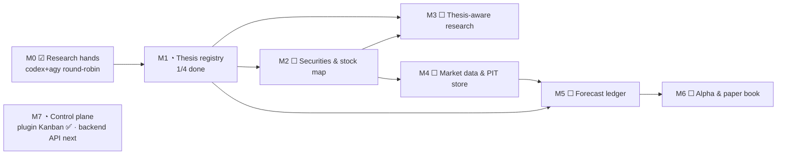
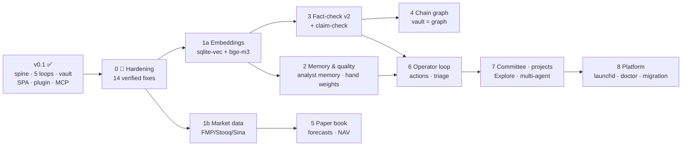

# institute-one

**A single-node AI research institute.** One Python process, one SQLite file, one Obsidian vault — a roster of AI analysts that writes briefings, debates on whiteboards, answers mail, and runs deep research on your own machine, using the agent CLIs you already pay for.

[简体中文文档 →](./README.zh-CN.md)



| | |
|---|---|
|  |  |
|  |  |

*More: [`docs/screenshots/`](docs/screenshots/)*

---

## What it does

Five self-driving loops, all running in Singapore time (SGT):

| Loop | Schedule | What happens |
|---|---|---|
| **Morning briefing** 晨会简报 | 08:30 | macro + themes + editor compile → vault `Briefing/` |
| **Analyst dailies** 观察日报 | 19:00 | every analyst writes sourced observations; **follow-ups auto-feed the whiteboard topic pool and mailbox** → vault `Analysts/<id>/` |
| **Daily report** 每日日报 | 23:00 | market review + outlook + editor compile → vault `Daily/` |
| **Whiteboard** 白板 | kickoff hourly | topic pool → board → analysts take turns writing cards, a constrained-JSON handoff picks the next voice → vault `Whiteboard/` |
| **Deep research** 深度研究 | drain every 30 min, cap 4/day | scored queue → 7-step workflow (incl. a follow-ups step that seeds new topics & mail) → vault `Research/<topic>/` |

The recursion: **dailies and research emit follow-ups → topics open boards, questions open mail threads → their outputs land in your vault** — bounded by per-source caps, topic dedup, a 2-active-board limit, and the rule that replies and cards never recurse further.

## Architecture

```
            ONE MACHINE · ONE PROCESS · 127.0.0.1:8100 · no auth on loopback
┌────────────────────────────────────────────────────────────────────────┐
│  app/  (FastAPI + asyncio, TZ=Asia/Singapore)                          │
│                                                                        │
│  institute/   analysts · workflows engine · scheduler · daily ·        │
│               analyst_daily · whiteboard · mailbox · research ·        │
│               archive (FTS5 search)                                    │
│  router/      executor — the `tasks` audit spine: submit()/spawn(),    │
│               global semaphore + per-hand mutex, orphan recovery       │
│  hands/       claude · codex · gemini · agy · opencode CLIs            │
│               (subprocess, login-shell env capture) · ollama (HTTP) ·  │
│               direct-API fallbacks · per-CLI rate-limit parsers ·      │
│               persistent cooldowns · fallback chains · circuit breaker │
│  vault/       VaultWriter (atomic writes, sha256 ledger, managed:      │
│               institute marker, never-clobber conflict siblings)       │
│  api/         REST · SSE event stream · /api/mcp (MCP JSON-RPC)        │
│  bus.py       every event → events table + SSE + vault exporter        │
│                                                                        │
│  frontend/dist  React operator SPA, served at /                        │
└────────────────────────────────────────────────────────────────────────┘
  Disk:  ~/.institute-one/{institute.db, workspaces/, archive/, logs/,
         backups/, rate_limits.json}
  Vault: $INSTITUTE_VAULT_DIR (e.g. <YourVault>/Institute) — a rebuildable
         projection; SQLite rows are the truth
```

**Design laws** (inherited from the systems this replaces — see `odm/proposal/PROPOSAL.md`):
every model invocation is a row in `tasks`; completion is a function return plus a bus event (no queues, no webhooks, no inter-component polling); state transitions use conditional-claim `UPDATE … WHERE status=?`; prompts are the product and stay byte-stable; cooldowns persist across restarts and are never auto-shortened; the vault is written by exactly one component under five safety rules.

## Quick start

### 0. Prerequisites

- macOS (Linux works; launchd notes are mac-only), Python 3.11+, Node 18+
- At least one agent CLI installed **and logged in**:

```bash
# Claude Code (recommended default)
npm install -g @anthropic-ai/claude-code && claude        # complete login once

# Codex CLI
npm install -g @openai/codex && codex                     # login

# Gemini CLI
npm install -g @google/gemini-cli && gemini               # login

# verify each works non-interactively:
claude -p "say hi" ; codex exec "say hi" ; echo "say hi" | gemini
```

Hands are auto-detected from your login-shell PATH (including `agy`, the Google Antigravity CLI, if you have it); each can be disabled with `INSTITUTE_ENABLE_<NAME>=false`. No CLI at all? The built-in `echo` hand keeps the system testable.

### 1. Install & configure

```bash
git clone <this-repo> && cd institute-one
./scripts/install.sh                 # venv + deps + frontend & plugin builds

cp .env.example .env                 # then edit:
#   INSTITUTE_VAULT_DIR=/path/to/YourVault/Institute   ← the subfolder the institute OWNS
#   INSTITUTE_ANTHROPIC_API_KEY=…                      ← optional API fallbacks
#   schedule times if 08:30 / 19:00 / 23:00 SGT don't suit you
```

### 2. Start

```bash
./scripts/start.sh                   # → http://127.0.0.1:8100
curl -s -X POST localhost:8100/api/ask -H 'content-type: application/json' \
  -d '{"prompt":"hello","hand":"echo"}'        # smoke test, no quota used
```

### 3. Install the Obsidian plugin

```bash
./scripts/install-plugin.sh /path/to/YourVault
```

Then in Obsidian: **Settings → Community plugins → enable “Institute One”**. You get a live dashboard sidebar, *Ask the Institute*, *Queue deep research*, vault export/doctor, archive search, mailbox, analyst-daily triggers, and a roadmap Kanban view (*Institute: 打开路线图*) — all against `127.0.0.1:8100`. Vault **reading** needs no plugin at all: notes appear under `Institute/` as plain Markdown with Dataview-friendly frontmatter.

### 4. (Optional) MCP for Claude Code / Claude Desktop

```json
// .mcp.json
{ "mcpServers": { "institute-one": { "type": "http", "url": "http://127.0.0.1:8100/api/mcp" } } }
```

Read tools plus exactly three writes: `research_queue_add`, `topic_pool_add`, `institute_ask`.

### 5. First runs

```bash
curl -X POST localhost:8100/api/workflows/daily/briefing/run-now          # today's briefing
curl -X POST localhost:8100/api/analysts/daily/run-now                    # full analyst sweep
curl -X POST localhost:8100/api/research/queue -H 'content-type: application/json' \
     -d '{"topic":"NVDA"}'                                                 # queue deep research
```

…or just press the buttons in the web UI / Obsidian sidebar. Watch progress on the Dashboard; results land in your vault minutes-to-an-hour later depending on the hand.

## Operations

```bash
./scripts/stop.sh                          # stop
tail -f ~/.institute-one/logs/server.log   # logs
.venv/bin/python -m pytest tests -q        # 39 tests, run on the echo hand
```

- **Pause everything new**: set `admin_state` key `maintenance` to `{"paused": true}` — kickoff jobs skip, in-flight work drains.
- **Quota walls**: per-CLI rate-limit signatures are parsed, cooldowns persist in `~/.institute-one/rate_limits.json` (never auto-shortened), tasks fall back along `claude ↔ codex ↔ gemini → *-api` (`gemini` and `agy` chain into each other first). Clear manually: `POST /api/hands/{name}/cooldown/clear`.
- **One CLI = one task at a time** (per-hand mutex). Parallelism comes from spreading across hands; analyst dailies round-robin claude/codex/gemini automatically. Deep-research steps round-robin the configured research hands (`INSTITUTE_RESEARCH_HANDS`, default `codex,agy`), and their rate-limit fallback stays inside that chain.
- **Backups**: nightly SQLite backup to `~/.institute-one/backups/` (03:00–05:00 SGT); the vault is a human-readable second copy of every product.
- **Vault safety**: notes carry `managed: institute`; if you hand-edit a note the institute never clobbers it — updates arrive as `… (institute update <date>).md` siblings; `POST /api/vault/doctor` reports drift.
- **Restarts are safe but not free**: in-flight tasks are marked `orphaned by restart` at boot and domain loops re-drive from durable rows — still, prefer restarting when the queue is idle (`GET /api/tasks/queue`).

## Roadmap — and you can vibe it yourself

v0.1 is the MVP slice (~25%) of the full single-node institute designed in [`../proposal/PROPOSAL.md`](../proposal/PROPOSAL.md). The rest is mapped, grounded, and **written to be built by you with an AI coding agent**: **[`ROADMAP.md`](./ROADMAP.md)** breaks every remaining feature into self-contained milestones — each grounded in the proposal section it implements, the legacy source it ports from, and the files to touch; keystone items carry a ready-to-paste prompt for Claude Code / Codex / Gemini. Pick a box, prompt your agent, review the diff, keep `pytest -q` green, tick it off.

There is also an execution-level **roadmap control plane** in [`roadmap/`](./roadmap/): design docs plus a machine-readable card board (`backlog.json`, phases M0–M7), where every non-trivial change flows design → card → coding session → diff → verification → review → release gate → done. The Obsidian plugin renders it as a roadmap Kanban view (command *Institute: 打开路线图*) and can export the board as a Markdown note. `ROADMAP.md` stays the long-horizon feature map; `roadmap/` is how individual cards get executed.

The execution track so far (statuses from `backlog.json`, 2026-07-02 — 3 done · 6 ready · 6 inbox of 15 seed cards):



And the long-horizon dependency map to the full proposal:



The dependency logic in one line: **embeddings unblock every similarity gate** (fact reuse, whiteboard dedup, claim-check); **market data unblocks the money loop**; fact-check feeds the chain graph and the operator loop; everything else parallelizes.

## Vibe-coding this repo (how to extend it with AI agents)

This entire codebase was written by AI agents in one day — a contract-first spine, parallel module generation, an integration pass, and an echo-hand test suite. It is deliberately shaped to stay easy to extend the same way. **Read [`CLAUDE.md`](./CLAUDE.md) first** — it encodes the project map, hard rules, and recipes; Claude Code picks it up automatically. Then work through [`ROADMAP.md`](./ROADMAP.md), which turns the remaining proposal into prompt-sized milestones.

Example prompts that work well here:

- *"Add a `grok` hand: CLI `grok` with `-p` prompt flag, fallback chain after codex. Follow app/hands/claude_hand.py, register in build_hands, add rate-limit signatures, write a registry test with a fake hand."*
- *"Add a weekly `committee` workflow: 3 analysts debate this week's biggest disagreement (mine recent whiteboard summaries for it), ops-editor compiles a verdict. JSON in workflows/, schedule Fri 20:00 SGT, vault export to Institute/Committee/."*
- *"Add a `coverage` page to the SPA showing each analyst's recent dailies/cards/research counts from /api/tasks aggregates."*

Advice that keeps the system healthy:

1. **Contracts before fan-out.** When generating multiple modules in parallel, write the shared interfaces (schema, function signatures) first, by hand or in one shot — generators that read contracts don't drift.
2. **Test on the echo hand.** Every loop is testable without burning quota: `INSTITUTE_DEFAULT_HAND=echo` + the `WRITE_FILE:` convention. Add a test per new loop; keep `pytest -q` green.
3. **Prompts are the product.** Copy/curate prompt strings deliberately, never let a refactor paraphrase them. Diff rendered prompts when touching `prompts.py`.
4. **Never churn the battle-tested**: `rate_limits.json` handling, `get_cli_env()`, the conditional-claim idiom, the five VaultWriter rules.
5. **Migrations are additive** — new numbered file in `migrations/`, never edit old ones. The roster (`catalog/analysts.json`) and workflows (`workflows/*.json`) are configuration: edit data, not code, where possible.
6. **Scheduler jobs never raise** — wrap with `metered()`, gate kickoff-type jobs on maintenance.
7. **Mind in-flight work** — agents love restarting servers; check `GET /api/tasks/queue` first (a restart orphans running CLI tasks).

## Provenance

Scoped MVP of the single-node architecture in [`../proposal/PROPOSAL.md`](../proposal/PROPOSAL.md) (itself the judged synthesis of three predecessor systems: agent-route, researchos, agent-route-node). Mechanisms carried over: login-shell env capture for daemon-spawned CLIs, per-CLI quota-signature parsing with persistent never-shorten cooldowns, breaker-neutral rate limits, the constrained-pick handoff, the date-anchor + citation-mandate + file-deliverable prompt sandwich.
