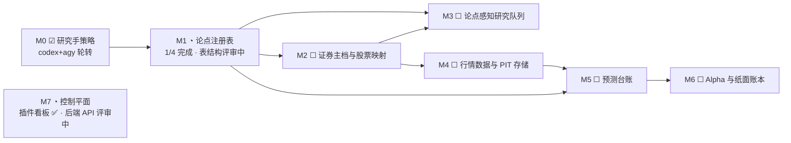
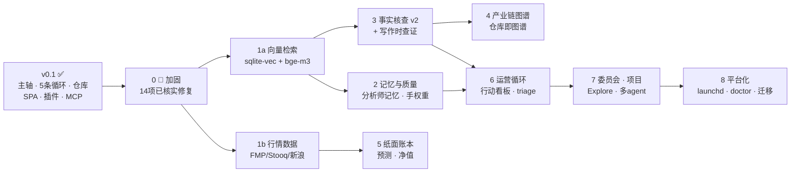

# institute-one · 单机 AI 研究所

**一台机器、一个 Python 进程、一个 SQLite 文件、一个 Obsidian 仓库。** 一支 AI 分析师团队在你自己的电脑上写晨报、上白板辩论、回信箱、跑深度研究——用的是你已经在付费的 agent CLI（Claude Code / Codex / Gemini）。

[English README →](./README.md) · [更新日志](./CHANGELOG.md)


| | |
|---|---|
|  |  |
|  |  |

*更多截图见 [`docs/screenshots/`](docs/screenshots/)*

---

## 它做什么

五条自驱动循环，全部按新加坡时间（SGT）运行：

| 循环 | 时间 | 内容 |
|---|---|---|
| **晨会简报** | 08:30 | 宏观 + 主线 + 编辑汇编 → 仓库 `Briefing/` |
| **分析师观察日报** | 19:00 | 每位分析师写当日带来源的观察；**跟进项自动进入白板议题池和信箱** → 仓库 `Analysts/<id>/` |
| **每日日报** | 23:00 | 市场复盘 + 展望 + 编辑汇编 → 仓库 `Daily/` |
| **白板** | 每小时开板 | 议题池 → 开板 → 分析师轮流写卡片，受约束的 JSON 交接挑选下一位 → 仓库 `Whiteboard/` |
| **深度研究** | 每 30 分钟消化队列，日上限 4 | 打分队列 → 7 步工作流（最后一步产出跟进项，反哺议题池与信箱）→ 仓库 `Research/<主题>/` |

递归引擎：**日报与研究产出跟进项 → 议题开白板、追问开信箱 → 产出再落仓库**。有界设计：每源跟进上限、议题哈希去重、最多 2 块活跃白板、回信与卡片不再递归。

## 架构

```
        一台机器 · 一个进程 · 127.0.0.1:8100 · 回环地址免鉴权
┌──────────────────────────────────────────────────────────────────────┐
│  app/  (FastAPI + asyncio, TZ=Asia/Singapore)                        │
│                                                                      │
│  institute/  分析师名册 · 工作流引擎 · 调度器 · 晨报/日报 ·          │
│              分析师日报 · 白板 · 信箱 · 深度研究 · 档案(FTS5检索)    │
│  router/     executor — `tasks` 审计主轴：submit()/spawn()、         │
│              全局信号量 + 每手互斥锁、重启孤儿回收                   │
│  hands/      claude · codex · gemini · agy · opencode CLI（子进程，  │
│              登录 shell 环境捕获）· ollama (HTTP) · 直连 API 兜底 ·  │
│              每 CLI 限额签名解析 · 持久冷却 · 回退链 · 熔断器        │
│  vault/      VaultWriter（原子写入、sha256 台账、managed:institute   │
│              标记、绝不覆盖人工编辑——冲突写并行副本）                │
│  api/        REST · SSE 事件流 · /api/mcp (MCP JSON-RPC)             │
│  bus.py      每个事件 → events 表 + SSE + 仓库导出器                 │
│                                                                      │
│  frontend/dist  React 操作台 SPA，挂载在 /                           │
└──────────────────────────────────────────────────────────────────────┘
  磁盘:  ~/.institute-one/{institute.db, workspaces/, archive/, logs/,
        backups/, rate_limits.json}
  仓库:  $INSTITUTE_VAULT_DIR（如 <你的Vault>/Institute）——可重建的投影；
        SQLite 行才是事实来源
```

**设计法则**（继承自其前身系统，详见 `odm/proposal/PROPOSAL.md`）：每次模型调用都是 `tasks` 表的一行；完成就是函数返回 + 总线事件（没有队列、没有 webhook、组件间不轮询）；状态迁移一律用条件认领 `UPDATE … WHERE status=?`；提示词就是产品本身、保持逐字稳定；冷却跨重启持久且从不自动缩短；仓库只由唯一组件按五条安全规则写入。

## 快速开始

### 0. 前置条件

- macOS（Linux 可用；launchd 部分仅限 mac）、Python 3.11+、Node 18+
- 至少装好并**登录**一个 agent CLI：

```bash
# Claude Code（推荐作为默认手）
npm install -g @anthropic-ai/claude-code && claude        # 完成一次登录

# Codex CLI
npm install -g @openai/codex && codex                     # 登录

# Gemini CLI
npm install -g @google/gemini-cli && gemini               # 登录

# 验证非交互调用没问题：
claude -p "你好" ; codex exec "你好" ; echo "你好" | gemini
```

手（hand）从登录 shell 的 PATH 自动探测（若已安装 `agy`，即 Google Antigravity CLI，同样会被探测到）；任何一只可用 `INSTITUTE_ENABLE_<名字>=false` 关闭。一只 CLI 都没有？内置 `echo` 手保证系统可测试。

### 1. 安装与配置

```bash
git clone <本仓库> && cd institute-one
./scripts/install.sh                 # venv + 依赖 + 前端与插件构建

cp .env.example .env                 # 然后编辑：
#   INSTITUTE_VAULT_DIR=/path/to/你的Vault/Institute   ← 研究所独占的子目录
#   INSTITUTE_ANTHROPIC_API_KEY=…                      ← 可选的 API 兜底
#   各定时任务时间（默认 08:30 / 19:00 / 23:00 SGT）
```

### 2. 启动

```bash
./scripts/start.sh                   # → http://127.0.0.1:8100
curl -s -X POST localhost:8100/api/ask -H 'content-type: application/json' \
  -d '{"prompt":"你好","hand":"echo"}'        # 冒烟测试，不耗任何额度
```

### 3. 安装 Obsidian 插件

```bash
./scripts/install-plugin.sh /path/to/你的Vault
```

然后在 Obsidian：**设置 → 第三方插件 → 启用 “Institute One”**。你会得到：实时仪表盘侧边栏、向研究所提问、排队深度研究、仓库导出/体检、档案检索、写信给分析师、触发分析师日报、以及路线图看板视图（*Institute: 打开路线图*）——全部直连 `127.0.0.1:8100`。**只读仓库内容完全不需要插件**：笔记以纯 Markdown + Dataview 友好 frontmatter 出现在 `Institute/` 下。

### 4.（可选）给 Claude Code / Claude Desktop 配 MCP

```json
// .mcp.json
{ "mcpServers": { "institute-one": { "type": "http", "url": "http://127.0.0.1:8100/api/mcp" } } }
```

只读工具 + 恰好三个写操作：`research_queue_add`、`topic_pool_add`、`institute_ask`。

### 5. 第一次运行

```bash
curl -X POST localhost:8100/api/workflows/daily/briefing/run-now          # 今天的晨会简报
curl -X POST localhost:8100/api/analysts/daily/run-now                    # 全员观察日报
curl -X POST localhost:8100/api/research/queue -H 'content-type: application/json' \
     -d '{"topic":"NVDA"}'                                                 # 排队深度研究
```

……或直接在 Web 操作台 / Obsidian 侧边栏点按钮。仪表盘看进度；几分钟到一小时后成果落进你的仓库。

## 日常运维

```bash
./scripts/stop.sh                          # 停止
tail -f ~/.institute-one/logs/server.log   # 日志
.venv/bin/python -m pytest tests -q        # 39 个测试，跑在 echo 手上
```

- **暂停一切新开工**：把 `admin_state` 的 `maintenance` 设为 `{"paused": true}` —— 开板/扫队任务跳过，进行中的自然收尾。
- **额度撞墙**：每 CLI 的限额签名会被识别，冷却写入 `~/.institute-one/rate_limits.json`（从不自动缩短），任务沿 `claude ↔ codex ↔ gemini → *-api` 回退（`gemini` 与 `agy` 会优先互为回退）。手动解除：`POST /api/hands/{name}/cooldown/clear`。
- **一只 CLI 同时只跑一个任务**（每手互斥锁）。并行度来自多只手；分析师日报自动在 claude/codex/gemini 间轮转。深度研究各步骤则在配置的研究手（`INSTITUTE_RESEARCH_HANDS`，默认 `codex,agy`）之间轮转，其限额回退也只在该链条内进行。
- **备份**：每晚（SGT 03:00–05:00）SQLite 备份到 `~/.institute-one/backups/`；仓库本身就是所有成果的人类可读副本。
- **仓库安全**：笔记带 `managed: institute` 标记；你手改过的笔记绝不会被覆盖——更新会以 `…（institute update <日期>）.md` 并行副本出现；`POST /api/vault/doctor` 报告漂移。
- **重启安全但有代价**：启动时未完成任务标记为「重启孤儿」，各循环从持久行自愈——但仍建议在队列空闲时重启（`GET /api/tasks/queue`）。

## 路线图——你可以自己「vibe」出来

v0.1 只是 [`../proposal/PROPOSAL.md`](../proposal/PROPOSAL.md) 完整单机研究所设计的 MVP 切片（约 25%）。其余部分已经全部规划、落地核实，并且**专门写成可由你 + AI 编程 agent 自行实现的形态**：**[`ROADMAP.md`](./ROADMAP.md)** 把每个剩余特性拆成自包含的里程碑——标注它实现提案的哪一节、从哪个前身项目移植、要动哪些文件，关键项还附带可直接粘贴给 Claude Code / Codex / Gemini 的提示词。选一个未勾选项，让 agent 开工，审查 diff，保持 `pytest -q` 全绿，打勾。

此外，[`roadmap/`](./roadmap/) 里还有一个执行层的**路线图控制平面**：设计文档加一块机器可读的卡片看板（`backlog.json`，阶段 M0–M7），所有非平凡改动都按 设计 → 卡片 → 编码会话 → diff → 验证 → 评审 → 发布门禁 → 完成 的流程推进。Obsidian 插件会把它渲染成路线图看板视图（命令 *Institute: 打开路线图*），并可将看板导出为 Markdown 笔记。`ROADMAP.md` 仍是长线特性地图；`roadmap/` 负责单张卡片的落地执行。

当前执行进度（状态取自 `backlog.json`，2026-07-03——16 张种子卡片中 3 张完成 · 2 张评审中 · 4 张就绪 · 7 张待定）：



通往完整提案的长线依赖图：



依赖逻辑一句话：**向量检索解锁所有相似度门控**（事实复用、白板去重、写作查证）；**行情数据解锁资金循环**；事实核查喂产业链图谱与运营循环；其余皆可并行。

## 用 AI 继续「vibe coding」这个项目

整个代码库由 AI agent 在一天内写成——先手写契约主轴，再并行生成模块，然后集成修复，最后 echo 手测试套件。项目刻意保持这种可继续生成的形态。**先读 [`CLAUDE.md`](./CLAUDE.md)**——它编码了项目地图、硬规则和操作配方；Claude Code 会自动加载它。然后按 [`ROADMAP.md`](./ROADMAP.md) 推进——它把提案剩余部分拆成了提示词大小的里程碑。

在这里效果很好的提示词示例：

- *「加一只 `grok` 手：CLI 名 grok，`-p` 传提示词，回退链排在 codex 后。参照 app/hands/claude_hand.py，在 build_hands 注册，补限额签名，用假手写一个 registry 测试。」*
- *「加一个每周 `committee` 工作流：3 位分析师就本周最大分歧辩论（从近期白板摘要里挖分歧），编辑汇编结论。JSON 放 workflows/，周五 20:00 SGT 调度，导出到 Institute/Committee/。」*
- *「给 SPA 加一个 coverage 页面：按分析师统计近期日报/卡片/研究次数（聚合 /api/tasks）。」*

保持系统健康的建议：

1. **先契约后并行。** 多模块并行生成前，先把共享接口（schema、函数签名）一次性写好——读契约的生成器不会漂移。
2. **用 echo 手测试。** 所有循环都能零额度测试：`INSTITUTE_DEFAULT_HAND=echo` + `WRITE_FILE:` 约定。每加一条循环配一个测试，保持 `pytest -q` 全绿。
3. **提示词就是产品。** 改动要逐字斟酌，绝不让重构顺手改写提示词；动 `prompts.py` 时 diff 渲染结果。
4. **不碰久经考验的部分**：`rate_limits.json` 的处理、`get_cli_env()`、条件认领惯用法、VaultWriter 五规则。
5. **迁移只增不改**——在 `migrations/` 加新编号文件，永不编辑旧文件。名册（`catalog/analysts.json`）与工作流（`workflows/*.json`）是配置：能改数据就别改代码。
6. **调度任务永不抛异常**——用 `metered()` 包裹，开工类任务受维护开关约束。
7. **当心在途任务**——agent 最爱重启服务器；先看 `GET /api/tasks/queue`（重启会孤儿化正在跑的 CLI 任务）。

## 渊源

本项目是 [`../proposal/PROPOSAL.md`](../proposal/PROPOSAL.md) 所述单机架构的 MVP 裁剪（该方案本身是三个前身系统 agent-route、researchos、agent-route-node 的评审合成）。保留的核心机制：守护进程拉起 CLI 的登录 shell 环境捕获、每 CLI 限额签名解析与持久不缩短冷却、对熔断器中性的限流处理、受约束的白板交接、以及「时间锚点 + 引用规范 + 文件交付」的提示词三明治。
