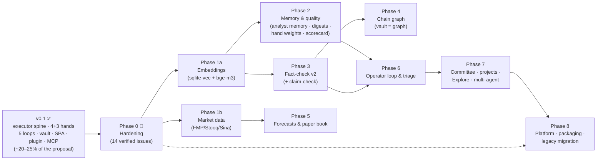
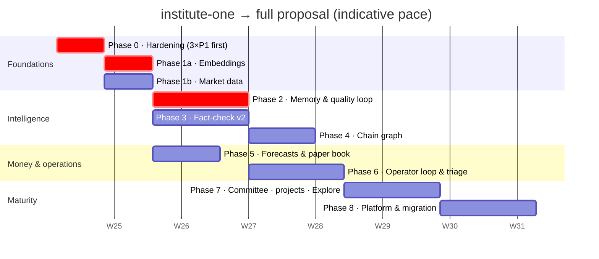

# institute-one — Roadmap

**From the v0.1 MVP to the full single-node AI institute described in [`../proposal/PROPOSAL.md`](../proposal/PROPOSAL.md).**

This file is written to be **vibe-coded**: every item is a self-contained milestone with grounding (which proposal section, which legacy source to port from, which current files to touch), and the keystone items carry a ready-to-paste prompt for Claude Code / Codex / Gemini — the rest give you enough grounding to write your own. Read [`CLAUDE.md`](./CLAUDE.md) first — it encodes the repo's hard rules; the prompts below assume the agent has it loaded.

How to use: pick an unchecked item (respect the dependency arrows in §0), paste the prompt, review the diff, run `pytest -q`, tick the box, commit. Items inside a phase are mostly independent; phases are ordered by dependency, not importance.

Status: ☑ done · ◔ partial · ☐ open. Effort: S < half a day · M ≈ a day · L ≈ days (with an AI agent doing the typing).

Execution tracking: day-to-day work now also flows through the roadmap control plane in [`roadmap/`](./roadmap/) — `roadmap/backlog.json` is the execution-level card board (phases M0–M7; every non-trivial change goes design → card → session → diff → verification → review → release gate → done), viewable as a Kanban in the Obsidian plugin ("Institute: 打开路线图"). This file remains the long-horizon feature map toward the proposal; the two coexist.

---

## 0. The map

**Dependency logic:** embeddings (1a) are the substrate for every similarity-gated mechanism (whiteboard gates, fact reuse, claim-check, semantic search). Market data (1b) is the substrate for paper-book MTM/NAV and research data injection. Fact-check (3) feeds chain enrichment (4) and the operator loop (6). Everything else is parallelizable.

**Indicative timeline** — one person + an AI coding agent, part-time pace; dates are relative, slide freely. The shape (what overlaps, what gates what) matters more than the dates:

The critical path (marked) runs hardening → embeddings → analyst memory → operator loop: it unlocks the flywheel ("the institute does not restart from zero") soonest. Phases 1b→5 and 3→4 are side tracks you can interleave whenever the main track is blocked on review or quota.

**Where v0.1 stands** (verified audit, 2026-06-11): the executor spine, hands/cooldown/breaker stack, whiteboard/mailbox/research/daily/analyst-daily loops with bounded follow-up recursion, SSE bus, VaultWriter (4 of 5 rules), 15-tool MCP, 12-page SPA, and the Obsidian cockpit all run today with 33 echo-hand tests — roughly **20–25% of the proposal's surface**. The biggest absences: embeddings, analyst memory (the flywheel), fact-check, chain graph, market data/paper book, the operator loop, and packaging.

---

## Phase 0 — Hardening (fix what's verified broken)

Findings from a code audit on 2026-06-11. The three P1s can silently halt the pipeline, leak compute, or burn quota — do them first.

- ☑ **P1 · Research queue deadlocks after restart** (S). A `running` queue row is never recovered: `recover_orphans()` sweeps only `tasks`, the janitor only `workflow_runs`, and `_claim_next()` refuses to claim while anything is `running` → the pipeline halts forever. Fix: boot-time sweep in lifespan (`running` → `pending` or `failed`), plus a test.
  > *Prompt:* In app/main.py lifespan, after executor.recover_orphans(), add research orphan recovery: UPDATE research_queue SET status='pending', started_at=NULL WHERE status='running' (log count). Extract it as research.recover_orphans(). Add a test in tests/test_research.py: insert a running row, call it, assert pending and that tick() can claim again.
- ☑ **P1 · Graceful shutdown leaks in-flight work** (M). Lifespan never cancels `executor._running` (nor workflow/whiteboard/mailbox background tasks) before `db.close()`; detached CLI process groups survive a hard kill (observed live: a `claude -p` survived `stop.sh`). Fix: shutdown hook draining all background-task registries with a timeout, then close DB; optionally persist child PGIDs and reap at boot.
- ☑ **P1 · MCP `research_queue_add` bypasses the cooldown gate** (S). It raw-INSERTs instead of calling `research.enqueue()`, skipping the 30-day cooldown. Same for `topic_pool_add` vs `whiteboard.add_topic` — which also computes a **different content hash** (cross-source dedup broken). Fix: MCP tools call the domain functions.
- ☑ **P2 · `analyst_daily._mark` lost-update race** (S). Read-modify-write of one JSON blob under `asyncio.gather` — concurrent finishes erase each other's marks → silent duplicate spend. Fix: per-analyst keys or a lock.
- ☑ **P2 · Research daily cap compares UTC timestamps to the SGT work date** (S). (The 30-day cooldown is UTC-to-UTC and fine.) Add a `work_date` column to `research_log` (additive migration), compare the cap on it.
- ☑ **P2 · Maintenance pause gates only 3 of 8 jobs** (S). Briefing/daily-report/whiteboard-tick/mailbox-sweep still spend quota while "paused". Decide semantics, gate accordingly; expose a maintenance toggle API + SPA switch (currently read-only `GET /api/admin/state`).
- ☑ **P2 · Interactive asks queue behind long workflow steps** (M). `executor.hand_busy(name)` + shared `prepare_ask()` prefer the first idle available hand along the fallback chain for interactive asks (explicit hand/model pins); `POST /api/tasks/{id}/cancel` gives queued/running tasks a real cancellation protocol.
- ◔ **P2 · No optional auth while `INSTITUTE_HOST` is settable** (S–M). `INSTITUTE_TOKEN` bearer middleware shipped (pure-ASGI, enforced when set, /health exempt, non-loopback warning; `start.sh` honors `$INSTITUTE_HOST`) — SPA/plugin/MCP clients have no token configuration surface yet.
- ☑ **P3 · Workflow JSON key drift** (S). `analyst` vs `analyst_id` both accepted; unknown ids silently become chief-strategist. Normalize at `reconcile_from_disk()`, warn loudly on unknown analysts.
- ☑ **P3 · Roster `lru_cache` ignores manual JSON edits** (S). mtime-checked cache.
- ☑ **P3 · `tasks.output` cap is chars-not-bytes and truncates silently** (S). Encode-aware cap + explicit `…[truncated]` marker.
- ☑ **P3 · launchd packaging** (M) → delivered in Phase 8 (`scripts/install-service.sh` + `institute` CLI).
- ◔ **P3 · Test gaps** (M–L): no API-route tests, no MCP round-trip test, no vault-exporter handler tests, no scheduler gating test → tracked in Phase 8 (those four suites now exist; remaining: frontend SSE automation + 7 removable skips — see Phase 8 test coverage).
- ☑ **P3 · Small bundle** (S): cancelled briefing blocks the day's rerun (`status != 'failed'` guard); whiteboard kickoff consumes the topic before the board insert (failure loses the topic); `compact_error` should keep first+last lines; add `POST /api/tasks/{id}/retry`.

---

## Phase 1a — Embeddings (the similarity substrate)

*Proposal §6.3, §10. Unblocks: whiteboard similarity gates, fact-check reuse tiers, claim-check, semantic search, topic diversity.*

- ☑ **sqlite-vec + bge-m3 plumbing** (M). Ollama `/api/embeddings` with `bge-m3` (1024-d); `vec_search` virtual table + `vector_chunks` metadata (additive migration); embed text artifacts at archive time; **graceful degradation**: Ollama down → every similarity gate returns "not duplicate / fresh" and search falls back to FTS5 (the proposal's documented best-effort posture).
  > *Prompt:* Add embeddings to institute-one per ROADMAP Phase 1a: app/institute/vectors.py wrapping Ollama bge-m3 (settings.ollama_host, new enable flag), sqlite-vec virtual table vec_search(embedding float[1024]) + vector_chunks metadata table in a new migration (additive!). Hook archive.snapshot_session to chunk+embed .md files (asyncio.to_thread, never fail the snapshot). Upgrade GET /api/archive/search (and add POST /api/search per proposal §9): cosine top-k via vec_search with FTS5 fallback when Ollama is unreachable. Add sqlite-vec to pyproject. Tests: fake embedder fixture; search returns semantic match; degradation path returns FTS5 results.
- ◔ **Whiteboard similarity gate + diversity pick** (M). Before kickoff: cosine vs recent boards — ≥0.85/14d skip, ≥0.65/30d augment the prompt with "BUILD ON prior work"; topic pick gets a diversity penalty instead of pure max-score. Thresholds as config rows, with a one-off distribution sanity check against ~50 known pairs (proposal §6.3). (Gate + config thresholds shipped; the ~50-known-pair distribution sanity check against real bge-m3 has not been run — thresholds are uncalibrated defaults.)
- ☑ **Topic-category weights** (S). `topic_category_weights` + category rotation guard in kickoff (proposal §10).

## Phase 1b — Market data

*Proposal §6.2 marketdata row, §9 Data row, §10. Port from `researchos/data-updater/src/*` (fetcher ladders, symbol-quirk tables, confidence-gated writes). Unblocks paper book; enriches research.*

- ☑ **`institute/marketdata.py`** (L — landed as `market_data.py` PIT store + `market_fetchers.py` ladder). FMP → Stooq → Sina fetcher ladder, `(topic, work_date)` upsert into `shared_data`, confidence-gated refuse-to-write, hourly scheduler job (maintenance-exempt), `GET /api/data/:topic/latest`, `GET /api/quote/:ticker`. Settings: `INSTITUTE_FMP_API_KEY` etc.; job disabled when no keys.
- ☑ **Research data injection** (S). Fetch the company bundle in `research_dispatch` and inline a ≤4KB summary into the financial steps via a `${DATA_BUNDLE}` variable — replacing "please web-search" with grounded numbers. (已接线: the production prompts in `workflows/research.json` now reference `${DATA_BUNDLE}` — round-5 prompt card.)

## Phase 2 — Memory & quality loop

*The proposal's flywheel: "the institute does not restart from zero" (§1; mechanisms in §6.1–6.2). Currently fully absent — analysts are stateless personas.*

- ☑ **Analyst memory** (L). `analyst_memory` table (versioned compacts); nightly 23:30 SGT compact job (cross-process claim lease since G2; prompt rule "DENSITY > LENGTH", forced retractions); memory injected into all seven analyst-prompt sites via the single `memory.prompt_with_memory` entrypoint (dailies/whiteboard cards/mailbox/workflow steps + ad-hoc ask/sessions/MCP); vault note `Analysts/<id>/memory.md` with VaultWriter rule 4 managed regions (`%% institute:begin/end %%`) so your annotations survive regeneration.
  > *Prompt:* Implement analyst memory per ROADMAP Phase 2: migration for analyst_memory(analyst_id, version, work_date, compact_md, supersedes); app/institute/memory.py with compact_one/compact_all (23:30 SGT metered+gated job) — prompt: compress the analyst's recent outputs (tasks/cards/dailies since last version, capped) into a dense standing memory, DENSITY > LENGTH, force retractions of invalidated views; inject latest memory as a context block in prompts.build_analyst_prompt callers (whiteboard cards, dailies, mailbox, workflow steps — add a helper memory_block(analyst_id)). Add managed regions to VaultWriter (rule 4 in app/vault/writer.py: content inside %% institute:begin/end %% is replaced, text outside survives; conflict siblings remain the whole-file fallback) + exporter writes Analysts/<id>/memory.md. Echo-hand tests for versioning, injection, and managed-region preservation.
- ☑ **Curl-back digest endpoints** (M). `GET /api/institute/{recent-reports, analyst-memory/:id, analyst-disputes/:id, operator-actions-digest}.md` endpoints shipped (plain markdown, 8KB caps; disputes/operator bodies now real since Phase 3/6 landed) — the Step-0 `curl 127.0.0.1:8100/...` block 已接线 into the CLI-hand prompts (the deliberate prompt-change card, round 5; proposal §6.1).
- ☑ **Hand weights + scorecard** (M — weighted picks are opt-in via `INSTITUTE_ENABLE_HAND_WEIGHTS`; the triage pane rides Phase 6). `hand_weights(scope, hand, weight)` with `pick_weighted_hand(scope, live_pool)` at resolve time (scopes: whiteboard/research/daily/mailbox); daily scorecard job porting `CHATTER_PATTERNS` false-complete/stub detection over `tasks`; `hand_stats` hourly windows; weights GET/PUT + scorecard API + a triage pane. Legacy: `hand-weights.ts`, `hand-scorecard.ts`.
- ◔ **Executor depth** (M). Retry lineage persisted (`fallback_chain`/`lineage_root`, migration 0024) with a partial unique index as the cross-process in-flight dedup key; `rate-limit-revival` scheduler job resurrects cooled-down `rate_limited` tasks (≤3/tick, one-shot claim marker). Remaining: per-hand queue-depth cap with `overcommitted` fast-fail.
- ☐ **Prompt-overrides** (M). `prompt_overrides` table (shadow → active → retired, per scope) layered over the prompt constants, with an operations API — makes prompt iteration data instead of code (and relaxes CLAUDE.md rule 4 safely).
- ☑ **`cron_metrics` + `/api/cron/health`** (S). `metered()` writes rows; a health endpoint + Settings pane show last/next fire, duration trend, error excerpts.
- ☑ **Streaming ask** (M). `POST /api/ask/stream` (NDJSON) wiring the existing `on_chunk` plumbing through; SPA + plugin render incrementally.

## Phase 3 — Fact-check v2

*Proposal §6.2 row 3. Legacy: researchos fact-check modules + Filter-A/B prompts + the verdict regex cascade (UNVERIFIABLE before DISPUTED) + `FACT_REUSE_POLICY`. Needs 1a.*

- ☑ **Claim extraction** (M). After whiteboard cards and research reports: an opencode/cheap-hand task extracts ≤3 checkable claims (Filter-A/B style prompt) → `fact_cards` rows (category taxonomy: numerical/financial/event/policy/…).
- ☑ **Tier-1 reuse gate** (M). Embed the claim, query `vec_factclaims`; per-category cosine thresholds + TTLs decide reuse vs re-verify; a disputed near-neighbor marks `self_contradicted`.
- ☑ **Verification** (M). A `websearch` verification task (claude/gemini with web access; the legacy vane hand stays optional) → verdict parsed via the regex cascade → `verified_facts`.
- ☑ **Disputed-claim surfacing** (M). Mailbox feedback thread to the claiming analyst; `Inbox/Disputed Claims.md` digest in the vault; `> [!warning]` callouts injected into the source dossier's managed region; Step-0 disputed-claims block in that analyst's prompts.
- ☑ **Claim-check-before-write** (S). `POST /api/meta/claim_check_before_write` + the Obsidian plugin command (check selection against verified/disputed facts while you write — the proposal calls it the highest-value writing-time feature).
- ☑ MCP: `fact_cards_list/get`, `claim_check` read tools.

## Phase 4 — Chain graph (the vault becomes the graph)

*Proposal §6.2 chain row + §8.1. The Obsidian graph IS the chain browser — backlinks replace a dedicated UI. Needs 3 (mentions come from facts/reports).*

- ☑ **Tables + INSTR backstop** (S). `chain_nodes/edges/mentions` (+ candidates); the backstop tagger is one SQL statement over new artifacts — ship it first.
- ☑ **Opencode tagger + auto-cluster/merge** (M–L). Entity extraction task per artifact; candidate promotion; periodic merge of aliases.
- ◔ **Vault projection** (M). `Chain/<entity>.md` note per node (managed regions); **`## Entities` wikilink footers** injected into every exported note; Dataview inline typed relations (`supplier_of:: [[台积电]]`); `_meta/Dashboards.md` starter Dataview queries. (Entity notes, wikilink footers + historical footer backfill shipped; Dataview typed-relation display and footer coverage across every new artifact kind are still incomplete.)
- ☐ **Properties + conflicts** (L, optional). `chain_properties` with the hybrid supersede/conflict policy; conflicts surface as operator actions (Phase 6). — skipped this build: optional.

## Phase 5 — Forecasts & paper book

*Proposal §6.2 money-loop rows. Needs 1b (quotes). Legacy: forecasts/paper-book/portfolios modules.*

- ☑ **Forecast extraction** (M). Regex extractor + ticker stoplist + CJK guard over research theses and daily reports → `forecasts` rows (direction, conviction, horizon).
- ☑ **Paper book** (L). Positions opened from forecasts (5-min opener job, caps); daily 00:00 SGT MTM/NAV/benchmarks; closes by stop/target/horizon; `Book/journal/<date>.md` appended nightly (append markers); NAV history; attribution flows into analyst memory.
- ☐ **Portfolios L1–L3 + Sunday proposer** (L, optional). Per-analyst virtual portfolios; Sun 22:00 proposer. — skipped this build: optional (no portfolio domain model yet).
- ☑ SPA pages: paper book + forecasts; MCP read tools.

## Phase 6 — Operator loop & triage

*Proposal §6.2 operator row. The institute starts managing itself; the human gate stays human. Needs 2 (scorecard feeds observations) + 3 (disputes file actions).*

- ☑ **Actions kanban** (M). `operator_actions` (open/in-progress/done/dismissed) fed by: vault conflicts, disputed facts, scorecard anomalies, failed runs; SPA `/operator` kanban page with triage panel and feature switches; MCP read tool.
- ☑ **Action router** (L). 15-min fast loop (cheap hand, small budget) + hourly deep loop (strong hand): classify actions, propose dispositions; **shadow mode first** (log, don't act), 0.7 confidence floor, hard human-pins for categories that must never auto-act (prompt/schedule changes).
- ◔ **Recipes / observations / proposals / effect measurement** (L). Minimal recipe loop shipped: an approved disposition can be promoted to a recipe, recurring same-kind actions get zero-model-call suggestions (still shadow, still through the human approve gate); observations/proposals/parameter-history/effect-measurement remain open (M8-008).
- ☑ **Triage page** (M). Maintenance toggle + drain status, feature switches (`feature_switches` in admin_state, per-subsystem), hand-weights pane, cron health, conflict list. (SPA `/operator` route with kanban/triage/switches panels; switches are enforced by `scheduler.metered()` — `job:<name>`=false skips the job and records a skip metric, default-enabled; PUT is version-CAS, concurrent writers get 409.)

## Phase 7 — Depth & breadth

- ◔ **Committee** (M). `workflows/committee.json` deliberation (mine recent whiteboard summaries for the week's biggest disagreement; 3 analysts argue; editor compiles a verdict with dissent recorded); 22:00 SGT on committee days; idempotent advance; vault `Committee/`. (Weekly idempotent deliberation workflow shipped; no persistent group/run records, no Committee Vault export or input snapshot yet.)
- ◔ **Research projects** (M). Group research runs + boards + threads under a named long-running project; project page; project digest endpoint. (Backend container + link/enqueue rails, idempotent unlink, archive/unarchive with a 409 link guard, and structured + markdown digest endpoints shipped; remaining: SPA project page, MCP `project_id` passthrough.)
- ☑ **BFS research tree / Explore mode** (L). Port `research-worker` `prompt.ts` + 7-step defensive `parser.ts` behavior; `research_tree_*` tables; server-side drain under the global semaphore; tree viewer in the SPA (proposal §6.2). (BFS engine with caps/stop/sweep + 5-min tick job; Trees page shows per-node status/score/depth live via the global durable event stream filtered by `ref_id` + 5s poll — a dedicated per-tree SSE endpoint was deliberately skipped as redundant; failed-node retry API + `SCORE: 0-100` extraction shipped in H3.)
- ☑ **Multi-agent vocabulary** (M). `fan_out(agents, prompt)` + `join(all|first_success|majority_vote|best_effort)`; `POST /api/multi-agent/run`; the ask/compare SPA page.
- ☑ **agy hand** (done 2026-06-11). Ported from `agent-route-node/app/hands/agy_hand.py` with the serial lock, flag-order rules, stdin=DEVNULL, brain/scratch artifact capture, and walkthrough inlining; gemini-family rate-limit signatures; chained `gemini ↔ agy`.
- ☐ **More hands** (S each). vane (search), mflux (image gen) — port from `agent-route-node/app/hands/*`. — skipped this build: optional breadth.
- ◔ **Bilingual twins** (M). `report.{zh,en}.md` convention for dossiers/briefings; locale toggle in the SPA. (Translation loop + `bilingual.twin_ready` events, bidirectional twin read API with coverage/failure surfaces, persisted locale preference (GET/PUT, `bilingual:locale`), and bounded retry — 3 attempts then queryable `permanent_failed` — shipped; SPA locale toggle still open.)
- ☐ **Favorites & visualizations** (M, optional). — skipped this build: optional.

## Phase 8 — Platform, packaging, migration

- ☑ **launchd service** (M). Plist template (`KeepAlive`, `RunAtLoad`, log paths) + `scripts/install-service.sh`; fix `stop.sh`'s broad pkill fallback.
- ☑ **`institute` CLI + unified doctor** (M). `institute start|stop|status|doctor` console script; doctor = hand auth checks (run each CLI's health probe), DB integrity (`PRAGMA integrity_check`), vault drift, cron health, orphan counts.
- ☑ **`/api/contract` + artifact refs** (S). Versioned contract (statuses, field caps, ref grammar `task:|note:|fact_card:`); `GET /api/artifacts?ref=`.
- ◔ **Test coverage push** (L). TestClient suites per router, MCP JSON-RPC round-trip, vault-exporter handler tests (synthetic bus events → assert notes), scheduler gating test, restart-recovery tests. (All five named suites shipped; vitest+jsdom frontend suite now covers the useSSE state machine — bootstrap paging, cursor reconnect, ring eviction, watchdog, filtered-feed reconcile — plus askStream NDJSON parsing; remaining: 7 removable skips — 6 over-broad bundle markers + 1 D4 restart probe.)
- ☑ **MCP expansion** (M). Toward the proposal's ~30 read tools (sessions, fact-check, paper-book, chain, cron-health) — writes stay at three. (35 tools in production; writes are exactly `institute_ask`/`topic_pool_add`/`research_queue_add`.)
- ☐ **Legacy data migration** (L, optional — only if you want the old researchos corpus). `migrate_d1.py` fixup-replay of researchos migrations + row import (verified facts, memory history, chain graph, research log, NAV history); R2 archive copier; golden-case prompt diffs if legacy prompt fidelity matters (proposal §12). — skipped: no legacy corpus on this machine (no old Vault/frontmatter/event/admin_state sources to migrate).

---

## Tracking

Tick boxes here as items land; keep `pytest -q` green per item; each phase ends with a soak: 48h unattended, `cron_metrics` clean, no orphans, vault doctor clean. When all phases close, this file should describe the system the proposal promised — on one machine, in one process.
