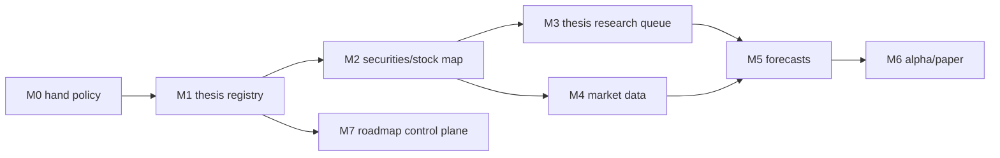

# 03 - Board Seed

## Initial Board Shape

The seed board converts `design/local-thesis-alpha/05-implementation-roadmap.md` into implementation cards. It also includes the cards required to build the roadmap control plane itself. The board is a view of the global coding process; cards should track coding sessions, verification, and release gates.

## Release Target

**Release A: Imported Thesis Registry + Forecastable Research**

Exit criteria:

- research hand policy is implemented;
- thesis registry exists and is populated from `market-thesis-data/`;
- securities and thesis-stock edges are imported from `market-thesis-data/`;
- thesis-aware research queue can enqueue structured tasks;
- tests cover core backend behavior.

**Release B: Measurable Alpha Loop**

Exit criteria:

- local market data store exists;
- forecasts can be created and settled;
- thesis scores can be computed;
- paper book can mark simple thesis baskets.

**Release C: Operator Portal**

Exit criteria:

- roadmap Kanban portal exists;
- thesis pages exist;
- forecast/alpha pages exist;
- vault projections exist.

## Initial Cards By Phase

### M0 - Research Hand Policy

- `M0-001` Research hand config and constrained fallback.
- `M0-002` Test research workflow uses configured hands only.

### M1 - Thesis Registry

- `M1-000` Document and validate market-thesis-data import contract.
- `M1-001` Add thesis schema migration.
- `M1-002` Implement thesis domain module and API.
- `M1-003` Import market-thesis-data bundle.
- `M1-004` Add thesis version history.
- `M1-005` Add frontend thesis tree page.

### M2 - Securities & Stock Map

- `M2-001` Add security master schema.
- `M2-002` Implement security lookup and aliases.
- `M2-003` Add thesis-security edge API.
- `M2-004` Add stock map panel to thesis detail.

### M3 - Thesis-Aware Research Queue

- `M3-001` Extend research queue schema.
- `M3-002` Add structured enqueue/dedup logic.
- `M3-003` Add thesis research workflow JSON contract.
- `M3-004` Parse final research JSON into thesis updates.

### M4 - Market Data & PIT Store

- `M4-001` Add calendar, bars, benchmark schema.
- `M4-002` Implement CSV import pipeline.
- `M4-003` Implement as-of resolver.
- `M4-004` Add data health checks.

### M5 - Forecast Ledger

- `M5-001` Add forecast and settlement schema.
- `M5-002` Add forecast API.
- `M5-003` Implement deterministic settlement.
- `M5-004` Display forecast ledger.

### M6 - Alpha & Paper Book

- `M6-001` Implement thesis basket projection.
- `M6-002` Add paper book schema.
- `M6-003` Mark paper book NAV.
- `M6-004` Add alpha scorecard.

### M7 - Roadmap Portal

- `M7-001` Add roadmap schema and seed import.
- `M7-002` Add roadmap API.
- `M7-003` Build Kanban board UI.
- `M7-004` Add card detail drawer and evidence log.
- `M7-005` Add coding session tracking.
- `M7-006` Add global coding process and release gate views.
- `M7-007` Add agent prompt generation from cards.

## Dependency Spine

The roadmap control plane can be implemented early because it mainly needs its own schema and UI. It becomes mandatory once multiple agents or long-running phases are active: implementation work should start from a card and finish with evidence.
