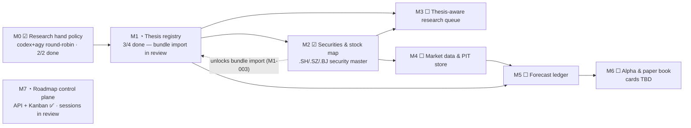

# Roadmap Control Plane

> Purpose: the global coding process for implementing `institute-one`, with an Obsidian-embedded Kanban portal as its operator surface.

`ROADMAP.md` is the historical phase checklist. This `roadmap/` package defines the next operating system for coding the project. The Kanban board is only one view. The deeper object is a durable implementation process: every design decision, coding session, agent prompt, diff, verification command, review, release gate, and follow-up becomes structured local state.

## Product Goal

Build a local implementation control plane for the thesis-alpha system:

- keep the implementation backlog in the repo and database;
- organize work as Kanban cards with dependencies, owners, evidence, and acceptance checks;
- connect cards to design docs, code files, tests, and running system events;
- let the operator steer implementation without using an external PM tool;
- make AI coding-agent prompts first-class card artifacts;
- track progress from idea to verified release;
- enforce a repeatable global coding process for humans and agents.

## Core Rule

Every non-trivial code change should flow through a roadmap card:

```text
design input -> roadmap card -> coding session -> diff -> verification -> review -> release gate -> done
```

The card is not just a ticket. It is the control record for the coding process. It tells the agent what to touch, how to verify it, what evidence is required, and which design decision it implements.

## Execution Map

Seed backlog: 16 cards across phases M0–M7 (8 done · 2 in review · 6 inbox as of 2026-07-03). Card statuses live in [backlog.json](backlog.json); with the roadmap API (M7-001) done and the plugin wired to it (M7-003, in review), Kanban drag-moves persist server-side when the backend is up, falling back to bundled-seed + local overrides offline.



Note: the Kanban board UI (card M7-003) shipped in `obsidian-plugin/src/roadmap.ts` ahead of its seed status — the seed still lists it as inbox because status flips wait on the M7-001 import.

## Reading Order

| File | Purpose |
|---|---|
| [01 Portal Design](01-portal-design.md) | UX, workflows, columns, card anatomy, and embedded app behavior. |
| [02 Data Model](02-data-model.md) | SQLite tables, APIs, event model, and import/export contracts. |
| [03 Board Seed](03-board-seed.md) | Initial Kanban lanes/cards for thesis-alpha implementation. |
| [04 Automation](04-automation.md) | How the portal connects to tests, git status, agents, and system events. |
| [05 Global Coding Process](05-global-coding-process.md) | The required coding lifecycle from design to shipped release. |
| [06 Agent Protocol](06-agent-protocol.md) | How Codex/Claude/Gemini-style agents should consume and update roadmap cards. |
| [07 Market Thesis Data Kickoff](07-market-thesis-data-kickoff.md) | Updated kickoff path using `market-thesis-data/` as the bootstrap base. |
| [08 Claude Coding Handover](08-claude-handover.md) | Detailed takeover brief for Claude or another coding agent. |
| [card-template.md](card-template.md) | Human-authored card template. |
| [backlog.json](backlog.json) | Machine-readable seed backlog for first import. |

## Design Principles

1. **Process first, board second.** Kanban is a projection of the coding process, not the process itself.
2. **Embedded, not external.** The roadmap control plane starts inside the local Obsidian plugin, then syncs with the same local SQLite database once the roadmap API exists.
3. **Cards must be executable.** Every implementation card needs scope, files, dependencies, acceptance checks, and verification commands.
4. **Evidence beats status.** A card is not "done" because it was dragged to Done; it is done when linked tests, screenshots, docs, or operator approval prove it.
5. **Design and implementation stay connected.** Cards link back to `design/local-thesis-alpha/` and forward to code modules.
6. **Agent prompts are assets.** Each card can carry a ready-to-run prompt for Codex/Claude/Gemini-style agents, with guardrails and expected outputs.
7. **Local first.** No hosted project-management dependency, no external issue tracker requirement.

## First Portal Scope

The first implementation should support:

- Obsidian roadmap view with columns and swimlanes;
- backlog import from `roadmap/backlog.json`;
- card detail drawer;
- markdown-backed Kanban note export for users of existing Obsidian Kanban plugins;
- coding session records;
- dependency blocking;
- checklist and acceptance criteria;
- verification command log;
- links to files/design docs;
- manual status changes;
- JSON export.

Later versions can add automatic test status, git diff summaries, AI-generated task decomposition, and release dashboards.
